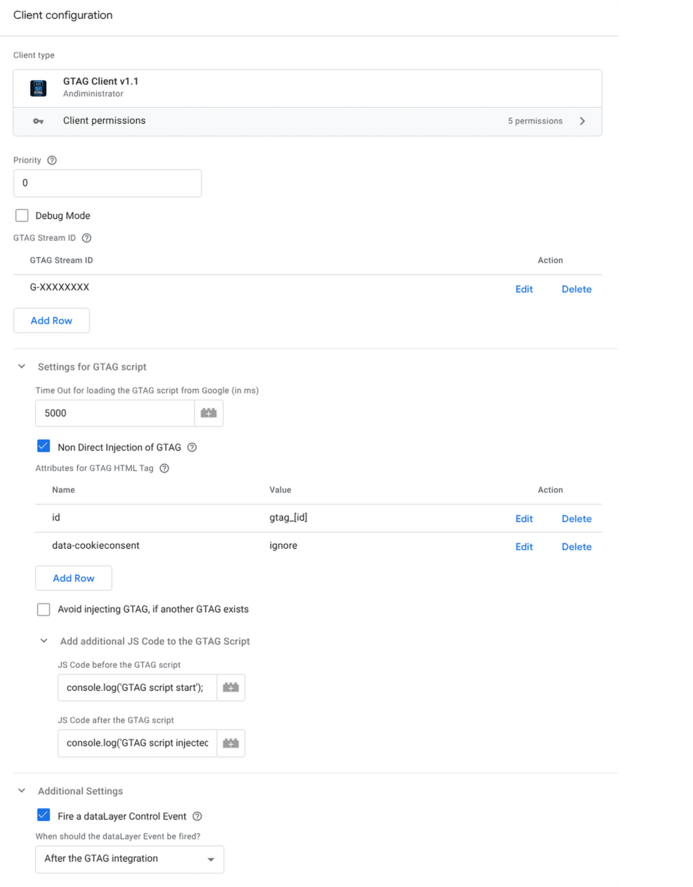

# GTAG Client for Server-Side Google Tag Manager

This is a **custom client template** for **Server-Side Google Tag Manager (sGTM)**.\
It is designed to receive **GTAG requests** (e.g., from a website through a client-side GTM) and return the requested GTAG without requiring a direct connection between the browser and Google.

## ✨ Features

- **Proxy GTAG Delivery**: Browser communicates only with your sGTM container, not directly with Google.\
- **Custom JavaScript Hooks**: Inject additional JS code *before* and *after* the GTAG script.\
- **dataLayer Control Event**: Optionally fire a dataLayer event after GTAG integration.\
- **Non-Direct Injection**: Insert GTAG via a DOM `<script>` element with customizable attributes.\
- **Measurement ID Limiting**: Restrict GTAG injection to specified Measurement IDs.

------------------------------------------------------------------------

## ⚙️ Configuration Options

### GTAG Stream ID

Define one or multiple **Measurement IDs (G-XXXXXXX)** to which GTAG should respond.

### Priority

Set the execution priority of the client. Default is `0`.

### Debug Mode

Enable verbose logging for debugging GTAG requests and responses.

### Settings for GTAG Script

- **Timeout**: Define maximum wait time (ms) for loading GTAG from Google (default: `5000`).\
- **Non-Direct Injection**: If enabled, GTAG is injected via a DOM `<script>` tag instead of direct injection.\
- **Attributes for GTAG HTML Tag**: Add custom attributes to the injected script tag (e.g., `id`, `data-cookieconsent`).\
- **Avoid Double Injection**: Skip injection if GTAG already exists on the page.

### Add Additional JS Code

- **Before GTAG**: Custom JS code executed right before GTAG script.\
- **After GTAG**: Custom JS code executed after GTAG script injection.

### Additional Settings

- **Fire a dataLayer Control Event**: Emits a custom event to the `dataLayer` once GTAG is integrated.
  -   Options: `After the GTAG integration`, `Before GTAG integration`.

------------------------------------------------------------------------

## 📖 Screenshot

------------------------------------------------------------------------

## 📦 Installation

1. Open your **Server-Side Google Tag Manager** container.\
2. Go to **Clients \> New \> Import Client Template**.\
3. Upload the provided `.tpl` file from this repository.\
4. Configure the Client according to your needs.

------------------------------------------------------------------------

## 🔍 Example Use Case

- Website sends GTAG requests via **Client-Side GTM**.\
- sGTM Client intercepts the request, injects GTAG, and returns it to the browser.\
- Google sees requests coming from your **sGTM server**, not directly from the browser.

------------------------------------------------------------------------

## 📜 License

Apache 2.0 License
